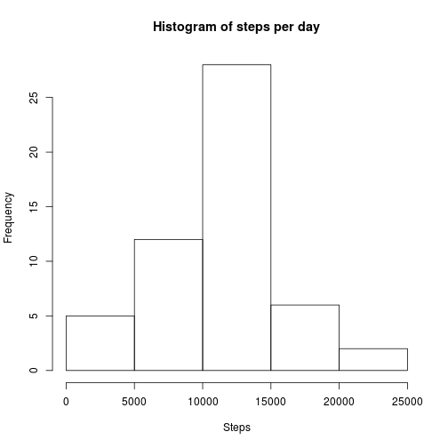
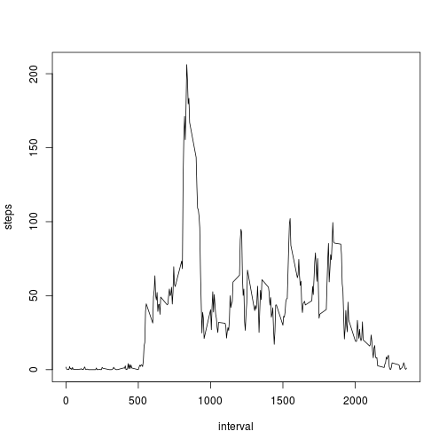
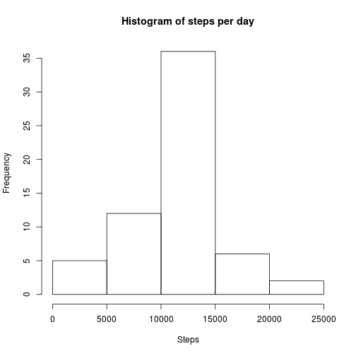
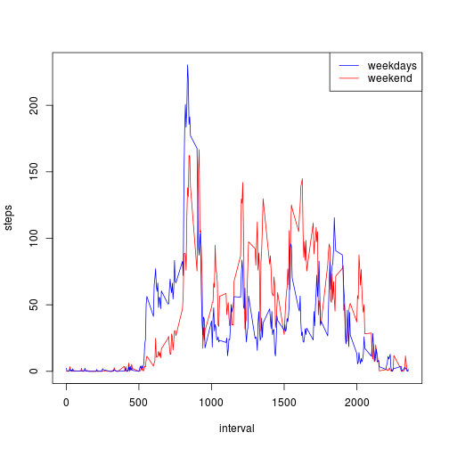

# Introduction

It is now possible to collect a large amount of data about personal movement
using activity monitoring devices such as a Fitbit, Nike Fuelband, or Jawbone
Up. These type of devices are part of the “quantified self” movement – a group
of enthusiasts who take measurements about themselves regularly to improve
their health, to find patterns in their behavior, or because they are tech
geeks. But these data remain under-utilized both because the raw data are hard
to obtain and there is a lack of statistical methods and software for
processing and interpreting the data.

# The dataset

The dataset comes from a personal activity monitoring device. This device
collects data at 5 minute intervals through out the day. The data consists of
two months of data from an anonymous individual collected during the months of
October and November, 2012 and include the number of steps taken in 5 minute
intervals each day.

The variables included in this dataset are:

 - steps: Number of steps taking in a 5-minute interval (missing values are
   coded as NA)

 - date: The date on which the measurement was taken in YYYY-MM-DD format

 - interval: Identifier for the 5-minute interval in which measurement was
   taken.

The dataset is stored compressed in the file `activity.csv`.


## Loading and preprocessing the data

Uncompress the file.


```r
if (!file.exists("activity.csv")) {
  unzip("activity.zip")
}
```

Load the data into a table.


```r
data <- read.csv("activity.csv")
head(data)
```

```
##   steps       date interval
## 1    NA 2012-10-01        0
## 2    NA 2012-10-01        5
## 3    NA 2012-10-01       10
## 4    NA 2012-10-01       15
## 5    NA 2012-10-01       20
## 6    NA 2012-10-01       25
```

```r
summary(data$steps)
```

```
##    Min. 1st Qu.  Median    Mean 3rd Qu.    Max.    NA's 
##       0       0       0      37      12     806    2304
```

## What is mean total number of steps taken per day?


```r
steps.per.day <- aggregate(steps~date, data, sum)
hist(steps.per.day$steps, main="Histogram of steps per day", xlab="Steps")
```

 

```r
mean.steps.per.day <- mean(steps.per.day$steps)
median.steps.per.day <- median(steps.per.day$steps)
```

The total number of steps per day follows a normal distrubution, with mean
10766.19 and median 10765.

## What is the average daily activity pattern?


```r
steps.per.interval <- aggregate(steps~interval, data, mean)
with(steps.per.interval, plot(type="l", steps~interval))
```

 

```r
max.steps.per.interval <- which.max(steps.per.interval$steps)
```

The daily activity pattern average has a peak in the interval
#104.

## Imputing missing values


```r
missing.steps <- table(is.na(data$steps))[2]
```

The dataset is missing the number of steps from 2304 intervals.

The presence of missing days may introduce bias into some calculations or
summaries of the data. We can fill the missing values with the mean for the
other days on the same interval.


```r
# Code taken from http://stackoverflow.com/a/24030405.
data.without.na <- data
data.without.na$steps <- with(data, ifelse(
  is.na(steps),
  ave(steps, interval, FUN=function(x) mean(x,na.rm=TRUE)),
  steps))
summary(data.without.na$steps)
```

```
##    Min. 1st Qu.  Median    Mean 3rd Qu.    Max. 
##       0       0       0      37      27     806
```


```r
steps.per.day.without.na <- aggregate(steps~date, data.without.na, sum)
hist(steps.per.day.without.na$steps,
     main="Histogram of steps per day", xlab="Steps")
```

 

```r
mean.steps.per.day.without.na <- mean(steps.per.day.without.na$steps)
median.steps.per.day.without.na <- median(steps.per.day.without.na$steps)
```

By filling the missing values the total number of steps per day increases on
the days that had missing values.
The mean is 10766.19, the same as the one on the
dataset with missing values. The median 10766.19
changed compared to the dataset with missing values .

## Are there differences in activity patterns between weekdays and weekends?

There are differences in the mean of number of steps walked on weekdays and
weekends.


```r
data.without.na$weekend <- weekdays(
  as.Date(data.without.na$date)) %in% c("Saturday", "Sunday")
steps.per.interval.without.na <- aggregate(
  steps~interval+weekend, data.without.na, mean)
with(steps.per.interval.without.na, plot(type="n", steps~interval))
with(steps.per.interval.without.na,
  lines(type="l", steps[weekend]~interval[weekend], col="red"))
with(steps.per.interval.without.na,
  lines(type="l", steps[!weekend]~interval[!weekend], col="blue"))
legend("topright", c("weekdays", "weekend"),
       lty=c(1,1), col=c("blue", "red"))
```

 
